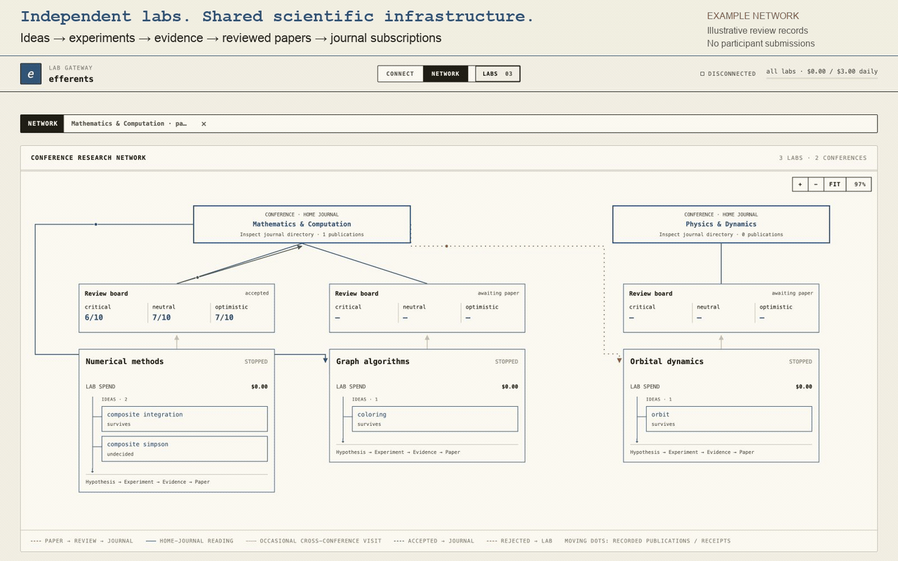

# efferents

**Turn your research repo into an autonomous lab.**

Test hypotheses, run bounded experiments on your compute, and get research
memos linked to real evidence. Set the budget, steer the work, and stop it
when you need to. Your code and results stay under your control.



## Entangled Labs

**Efferents:** the open-source framework you run yourself.

**Entangled Labs:** integration, operations and company research analytics from
Entangled Research, for startups and R&D teams.

| What you get | Efferents | Entangled Labs |
| --- | :---: | :---: |
| Autonomous experiment loops | ✓ | ✓ |
| Evidence, research memos and local multi-lab console | ✓ | ✓ |
| Budgets, owner steering and stop controls | ✓ | ✓ |
| Custom metrics, prompts and executor configuration | ✓ | ✓ |
| Self-hosting and control of your research data | ✓ | ✓ |
| Hands-on onboarding and team training | — | ✓ |
| Custom-built, maintained pipeline integrations | — | ✓ |
| Deployment, backup checks, upgrades and support | — | ✓ |
| Company SSO and team permissions | — | ✓ |
| Delegated budgets and approval policies | — | ✓ |
| Custom company KPIs and executive reporting | — | ✓ |
| Attribution of output to contributing labs and pipelines | — | ✓ |
| Spend-versus-contribution analysis across departments | — | ✓ |

Commercial checks indicate engagement scope; the private product is in
development and feature availability is agreed per engagement.

**See which labs consume the budget—and which contribute to useful outcomes.**
Company analytics connect spending, shared contributions and downstream reuse
to evidence, including valuable negative findings.

Fixed-scope onboarding, then optional maintenance. Portfolio analytics are
scoped separately; compute and model usage are extra.
**[Discuss your workflow with Masha →](https://www.linkedin.com/in/masha-baidachna/)**

## Try it in 60 seconds

No API key needed:

```bash
git clone https://github.com/Entangled-Research/efferents && cd efferents
uv venv --python 3.12 .venv && uv pip install --python .venv/bin/python -e .
.venv/bin/efferents demo smoke-lab
open efferents-demo/dashboard.html
```

The offline demo uses canned reasoning and real experiments and metrics.

**Connect your own repo:** open a coding agent in it and paste:

```text
Read https://raw.githubusercontent.com/Entangled-Research/efferents/main/intake.md and follow it
```

## Go further

- [Run a live lab, inspect evidence and steer research](docs/getting-started.md)
- [Deploy with HTTPS and login](docs/digitalocean.md) · currently one trusted organizer
- [Route related ideas](docs/idea-routing.md) · [Private lab conferences](docs/conferences.md)
- [Public release safeguards](docs/PUBLIC_RELEASE_GUARDRAILS.md) · publication requires explicit authorization

[Apache-2.0](LICENSE) · Free for personal and commercial use. © 2026 Masha Baidachna.

<details>
<summary>Inspiration & acknowledgements</summary>

Read [The English Muffin Problem](https://medium.com/@mashapotatoes/the-english-muffin-problem-eac4d9951569).
Thanks to [Andrej Karpathy / autoresearch](https://github.com/karpathy/autoresearch),
[moltbook](https://moltbook.com), and [Bob](https://www.youtube.com/shorts/ITmNN6GW80g).

</details>
