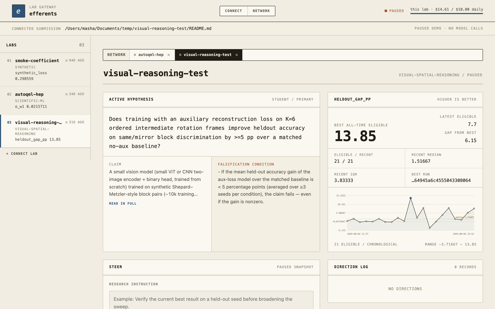
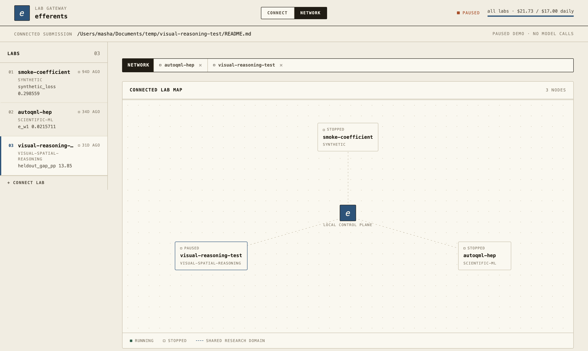

# efferents

**Turn your research repo into an autonomous lab.**

efferents runs bounded experiments on *your* compute and writes auditable
internal research memos into a local lab journal. It frames
a falsifiable hypothesis, plans an experiment, runs it against your own
train/eval commands, and records every result claim back to a run, a metric, or
a code diff.

> Not a chatbot and not an automatic code/data upload. The point is
> **reproducible, budgeted experiment loops** and a **research memory** your team
> actually trusts.



The lab gateway is the operating surface for the lab’s funder: connect a
repository without executing it, flip between running labs like editor tabs,
inject auditable research direction, start or stop spending explicitly, and
inspect progress without reading every run or paper. The workspace is a
light-only paper ground with azulejo cobalt (`#2d5379`) as the single signal
accent and terracotta (`#a8502b`) reserved for falsification conditions and
warnings — mono-led type for headings, slugs, and evidence; plain sans for
prose.

## Launch with your agent

Open your coding agent in an existing research repo or a fresh project folder
and give it this one instruction:

```text
Read https://raw.githubusercontent.com/Entangled-Research/efferents/main/intake.md and follow it
```

The agent-facing [`intake.md`](./intake.md) leads through framework installation,
lab configuration, a Popper-probed first hypothesis, validation, and a bounded
first cycle. The same instruction — with copy button — is the default tab of the
gateway's Connect page.

### Open the lab gateway

Once Efferents is installed, launch the gateway independently:

```bash
efferents serve
```

The gateway has two top-level views:

- **Connect** is the landing page, with two tabs. *Launch via agent* (default)
  gives the one-line intake instruction to paste into a coding agent; *Submit a
  repo* takes a GitHub repository/README URL or a local path and validates the
  lab contract — checkout, `lab.yaml`, falsifiability gate — without executing
  repository commands.
- **Network** is a near-fullscreen map of every lab in the local registry, with
  a docked rail listing them. The topbar budget shows the summed spend and caps
  across all labs here.

Clicking any lab — in the rail or on the map — opens it as a **tab**, VS Code
style, next to the permanent NETWORK tab. Each lab page carries the active
hypothesis with its falsification condition, a validity-aware metric panel and
trend, the **Steer** form and append-only direction log, lab-declared visual
evidence with eligibility gates, the run ledger, paper register, and agent
activity. The topbar budget switches to that lab's own spend and daily cap.
Open tabs persist across reloads, so flipping between several steering
sessions stays cheap.



## Why automate the whole research loop

There is a particular frustration in manually passing LLM-written paper drafts
to LLM-written reviews, then copying the criticism back into another model and
trying to keep the evidence straight yourself. If both sides of that exchange
are already machine-assisted, the useful move is to automate the loop openly:
hypothesis, experiment, analysis, draft, review, rebuttal, and revision — while
keeping every claim attached to provenance and every consequential action under
an explicit budget or approval boundary.

Efferents is that automation layer. It does not treat generated prose as the
result; the result is the reproducible experiment record underneath it.

Read the motivating essay, [The English Muffin Problem](https://medium.com/@mashapotatoes/the-english-muffin-problem-eac4d9951569),
on Medium.

## Who it's for

ML / R&D teams who run a lot of internal experiments and want an agent that
explores the parameter/idea space overnight — **without** shipping code, data,
or results to a third party, and **without** producing unverifiable prose. Every
nontrivial claim in a memo points at evidence.

## Why local-first

- **Your compute, your data.** Experiments run via commands you define
  (`train.py`, `eval.py`). Nothing leaves the machine except the LLM calls you
  opt into — and the offline demo makes none.
- **Reproducible memos.** Outputs are plain Markdown + JSONL (`runs.jsonl`,
  `claims.jsonl`) you can diff, grep, and check into a repo.
- **Provenance by construction.** Each result claim resolves to a `run_id`, a
  metric file, a log, or a code diff — not a vibe.
- **Budgeted.** A wall-clock execution guardrail plus an LLM spend ledger; an
  approval mode that pauses after planning and before execution.

## 60-second quickstart (no API key needed)

```bash
git clone https://github.com/Entangled-Research/efferents && cd efferents
uv venv --python 3.12 .venv && uv pip install --python .venv/bin/python -e .
.venv/bin/efferents demo smoke-lab        # or: python -m efferents demo smoke-lab
open efferents-demo/dashboard.html
```

This runs a bounded, **fully offline, deterministic** experiment loop on a toy
synthetic task and writes a complete lab journal:

```
efferents-demo/
├── journal/
│   ├── 001_hypothesis.md        # framed, falsifiability-gated claim
│   ├── 002_experiment_plan.md   # plan recorded before any run executes
│   ├── 003_results.md           # run table, best run, reading
│   └── 004_reviewed_memo.md     # reviewed memo + evidence table
├── runs.jsonl                   # one line per experiment run
├── claims.jsonl                 # each claim → run_id / metric / source
└── dashboard.html               # static dashboard of the above
```

The agent reasoning in the demo is deterministic and offline; the *experiment*
is real (it executes the lab's run command and records the actual metric).

The generated `dashboard.html` is a static, self-contained evidence report. It
is the portable artifact counterpart to the interactive local website shown
above:


### Example output — the reviewed memo

Every memo carries: **Summary · Hypothesis · Experiment plan · Results ·
Reviewer notes · Limitations · Next experiment · Evidence table.** The evidence
table is the contract:

| claim | evidence_type | source_path | run_id | metric |
|-------|---------------|-------------|--------|--------|
| synthetic_loss is minimized near coefficient 0.81 | run_metric | `logs/run_004_081.log` | `run_004_081` | synthetic_loss |
| Best run beats the 0.05 falsifier threshold | run_metric | `runs.jsonl` | `run_004_081` | synthetic_loss |
| Runs inside (0.75, 0.85) all stay below threshold | metric_aggregate | `runs.jsonl` | — | synthetic_loss |

## Point it at your own repo

Drop an `efferents.yaml` at your ML repo root
([full runnable example](examples/repo-adapter/efferents.yaml)):

```yaml
goal: "maximize validation F1 by tuning the decision threshold, under 2 GPU hours"
train_command: "python train.py --config {config_path}"   # {config_path}: per-run config
eval_command: "python eval.py --checkpoint {checkpoint}"   # {checkpoint}: from train stdout
config_template: configs/base.yaml
sweep:
  param: threshold
  values: [0.30, 0.50, 0.65, 0.80, 0.90]
metric: "val_f1"
maximize: true
budget:
  max_gpu_hours: 2
  max_llm_cost_usd: 20
approval:
  mode: "plan_then_execute"
```

Then run a bounded sweep against it — also **offline**, executing the repo's own
train/eval each iteration and writing the same journal + provenance:

```bash
efferents run examples/repo-adapter      # writes the plan only
efferents run examples/repo-adapter --approve
open efferents-run/dashboard.html
```

The bundled example is a real (toy) classifier: the lab sweeps the decision
threshold, finds the interior `val_f1` optimum, and records every run's
train/eval log. Your repo's `train`/`eval` plug in where the example's do. The
contract is simple: `train` prints `{"checkpoint": "<path>"}` on stdout, `eval`
prints `{"metrics": {"<metric>": <value>}}`.


## Safety, budget & approval

- **Approval modes:** `plan_then_execute` (default — first invocation writes
  the plan; `--approve` authorizes it), `dry_run` (plan only), `autonomous`
  (sandbox use only).
- **Budget accounting:** repo-adapter subprocess wall time is charged
  conservatively against `max_gpu_hours`; this is a guardrail, not GPU
  telemetry. The live loop records model-token spend (Sonnet by default; Opus
  only where configured). External tool fees are recorded where reported.
- **Explicit local execution:** `efferents serve` opens the local lab gateway.
  Connecting a repository clones and validates it but never runs its commands.
  Starting and stopping require an explicit confirmation; steering is appended
  to the auditable research log.
- **Public-release preflight:** `efferents public-check <repo>` scans the tracked
  tree and reachable git history for high-confidence disclosure risks, requires
  explicit licence terms and a clean release commit, and cannot pass until a
  named human acknowledges the rights/privacy/export/security checklist. It
  never changes repository visibility or uploads anything. See
  [`docs/PUBLIC_RELEASE_GUARDRAILS.md`](./docs/PUBLIC_RELEASE_GUARDRAILS.md).
- **Falsifiability gate:** a hypothesis must pass an adversarial
  [popper-probe](https://github.com/mashathepotato/popper-probe) dialogue before
  the lab will spend compute on it.

## Running a live lab (needs a model provider)

```bash
cp .env.example .env        # choose a model and add its provider key
efferents validate --submission examples/smoke-lab/
efferents start    --submission examples/smoke-lab/
efferents serve                                      # open the local entry page
```

Claude remains the zero-configuration default (`ANTHROPIC_API_KEY`). To use a
different provider, set a [LiteLLM model identifier](https://docs.litellm.ai/docs/providers)
and its provider credential, for example:

```dotenv
EFFERENTS_MODEL=openai/gpt-5
OPENAI_API_KEY=...
```

`EFFERENTS_MODEL_<ROLE>` can override individual roles such as `CODER`,
`ANALYST`, or `REVIEWER`. `EFFERENTS_API_BASE` points OpenAI-compatible models
at a custom endpoint. Local providers such as `ollama/...` do not require an
API key.


Submit a GitHub repository or README URL on the Connect page. A valid lab
submission has a `README`, `lab.yaml`, and Popper-passed `hypothesis.md`.
Efferents checks the repository out under `~/.efferents/checkouts/`,
initializes its file-backed state, and opens the lab as a tab in the gateway —
hypothesis, metrics, evidence, run ledger, papers, agent activity, and
steering on one page, with the network map one tab away.

To open a known lab directly, use
`efferents serve --lab-root examples/smoke-lab/lab`.

See [`intake.md`](./intake.md) for the canonical agent-led launch flow and
[`the user-flow design`](./docs/superpowers/specs/2026-07-19-user-entry-and-lab-visibility-flow-design.md)
for the longer-term product boundary.

## Contact

Masha Baidachna: [LinkedIn](https://www.linkedin.com/in/masha-baidachna/)


## Acknowledgements

- **Andrej Karpathy** — for [autoresearch](https://github.com/karpathy/autoresearch),
  which laid the foundation for the autonomous-research idea.
- **[moltbook](https://moltbook.com)** — for connecting a network of agents in a
  creative way.
- **[Bob](https://www.youtube.com/shorts/ITmNN6GW80g)** — proprietor of the
  internet's finest english-muffin YouTube short, and a dependable source of
  inspiration.

## License

[Apache-2.0](./LICENSE). © 2026 Masha Baidachna. You can clone, modify, and use
efferents — including internally and commercially — under the terms of the
license.
